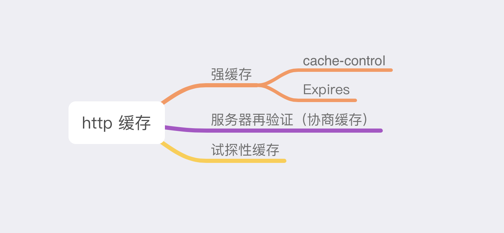

# http 缓存



缓存对用户体验的提升是明显的，特别是用户网络不好或者服务器带宽小的情况下。因此，对缓存的控制非常重要。通过本文可以了解 http 缓存，从而根据业务来对缓存进行控制。

## 目的

1. 理解缓存类型
2. 掌握如何设置缓存策略以及使用缓存资源的流程

> 在 http 权威指南中有些语句中缓存表示那些实现 http 缓存规范的 “容器” 。我理解像浏览器或者 CDN 节点服务器都可以被叫做缓存。本文中使用缓存代理来表达相同的意思。

## 强缓存

当 http response headers 中包含 cache-control 或者 expires 时，缓存代理会进行强缓存，同时 cache-control 或者 expires 会定义缓存的有效期。

cache-control 和 Expires 的区别

- Expires 是 http/1.0 中定义的；Cache-control 是 http/1.1 中定义的，旨在弥补 Expires 的不足。
- Expires 的 值是一个标准时间格式：`Sat, 13 Feb 2021 01:58:19 GMT`，表示缓存到期的时间，但是由于服务器和本地计算器的时钟误差，可能导致缓存到期时间不准确。因此引入 Cache-control 。通过 cache-control: max-age=48000 。表示缓存资源到期的相对时间，再结合 age 首部，让缓存代理可以轻松准确的判断出过期时间。
- cache-control 还有很多其他的取值，从而对缓存更有效的控制

> age 首部表示提供该资源的服务器创建该资源到目前的相对时间，秒为单位

### cache-control 取值

#### 缓存请求指令

客户端可以在HTTP请求中使用的标准 Cache-Control 指令。

```http
Cache-Control: max-age=<seconds>
Cache-Control: max-stale[=<seconds>]
Cache-Control: min-fresh=<seconds>
Cache-control: no-cache
Cache-control: no-store
Cache-control: no-transform
Cache-control: only-if-cached
```


刷新浏览器页面时，浏览器对页面的请求使用的是 cache-control: max-age=0，但是会发送协商缓存的请求头，比如：if-modify-since 或者 if-none-match。强制刷新浏览器页面时，浏览器对页面的请求使用的是 cache-control: no-cache。

#### 缓存响应指令

服务器可以在响应中使用的标准 Cache-Control 指令。

```http
Cache-control: must-revalidate
Cache-control: no-cache
Cache-control: no-store
Cache-control: no-transform
Cache-control: public
Cache-control: private
Cache-control: proxy-revalidate
Cache-Control: max-age=<seconds>
Cache-control: s-maxage=<seconds>
```

当有 http request 访问被强缓存的资源时，缓存代理会检查缓存是否有效，如果有效，则直接利用缓存的资源同时返回 http status code 200，反之，如果定义了协商缓存，会进行协商缓存的流程，如果没有定义，会去向服务器请求资源。

## 协商缓存

响应头是 last-modifyed 或者 etag 时是缓存代理会进行协商缓存，即使用缓存时先向 server 询问是否过期，request headers 中包含 if-modify-since 或 if-none-match ，如果缓存没过期，服务器会返回 304 http status code；当缓存过期时，服务器返回需要的资源，同时http status code 设置为 200，缓存代理收到后，会更新缓存。

last-modifyed 或 etag 总是同时出现，原因是向后兼容。last-modifyed 是 http/1.0 引入的，精确度为**秒**；etag 是 http/1.1 引入的，是资源的 hash 值，只要资源变动，结果都会变化。

etag 支持弱的校验:

```http
etag: W/"968deebc3e8869c1e260c8e77f7b1aad"
```

## 试探性缓存

试探性缓存是缓存代理通过试探性缓存算法尝试缓存资源，并在需要的时候直接返回。当响应头中只有协商缓存，并没有强缓存的响应头，此时缓存代理会进行试探性缓存。

试探性缓存的算法通常根据 last-modifyed 和 date 来确定缓存。如果缺少这两个响应头，则会使用一个小时或者一天的缓存时间。

这也就解释了


上图中请求的 js 资源并没有设置强缓存，但是仍然被浏览器返回 http status code 200，而不是 304。原因就在于浏览器的试探性缓存。

## 参考

[MDN: Cache-Control](https://developer.mozilla.org/zh-CN/docs/Web/HTTP/Headers/Cache-Control)

